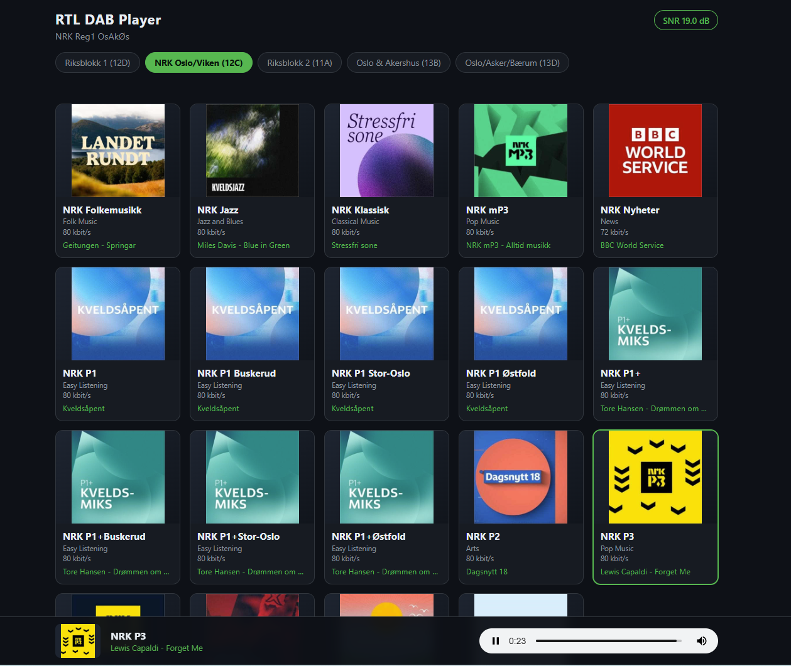

# RTL DAB Player

RTL DAB Player receives a full DAB multiplex with [welle-cli](https://github.com/AlbrechtL/welle.io), decodes every station simultaneously, and serves them two ways: a built-in web UI with station logos, now-playing info and one-click playback, and permanent Icecast mounts that any network player (VLC, Sonos, Squeezebox, …) can tune into.

*Based on [Lyrion_DAB_Radio](https://github.com/macsatcom/Lyrion_DAB_Radio) by Kasper S Nielsen; the LMS plugin has been replaced by a standalone web player.*



## Features

- **Web player** — station grid with broadcaster-sent logos/artwork (MOT slideshow), genre and bitrate per station, live "now playing" text (DLS), and click-to-play with a persistent bottom player bar
- **Whole-mux reception** — one dongle decodes every station on the multiplex at once; all stations stream 24/7 to Icecast with live song metadata
- **Multiplex switching** — switch between configured ensembles from the UI; the last known station list appears instantly while the tuner retunes, and a clicked station starts playing automatically the moment its stream is up
- **Signal monitoring** — live SNR indicator in the UI, plus per-station error counters and audio levels logged for diagnostics
- **Self-healing** — watchdogs restart welle-cli (HTTP health-check) and any dead ffmpeg relay; optional nightly preventive restart

## Architecture

```
RTL-SDR dongle
      ↓
  welle-cli -c 11C -Dw 9090     (decodes all services, serves MP3 over HTTP)
      ↓ http://localhost:9090/mp3/<SID>     (one stream per station)
  ffmpeg → Icecast /dab/<station>           (stream copy — no re-encode)
      ↑                    ↓
  dab-daemon ──────── /listen/<sid> proxy
  (web UI + HTTP API on :9980)
```

The daemon manages welle-cli and one ffmpeg relay per station, discovers services automatically (no SIDs or frequencies to configure), pushes DLS song titles to Icecast, and serves the web UI. Browser playback goes through the daemon's `/listen` endpoint, which holds the connection open during a mux switch and starts the audio as soon as the stream is live.

## Quickstart (Docker)

Everything runs in one container: welle-cli, ffmpeg, Icecast, and the daemon.

**Prerequisites:** Docker with Compose, an RTL-SDR dongle, and the DVB kernel drivers blacklisted on the host:

```bash
echo -e "blacklist dvb_usb_rtl28xxu\nblacklist rtl2832\nblacklist rtl2830" \
    | sudo tee /etc/modprobe.d/blacklist-rtlsdr.conf
sudo modprobe -r dvb_usb_rtl28xxu rtl2832 rtl2830
```

Then:

```bash
git clone https://github.com/hsand/RTL-DAB-Player.git
cd RTL-DAB-Player/docker
cp .env.example .env      # set passwords, mux list, etc.
docker compose up -d --build
```

The first build takes several minutes (welle-cli compiles from source). Once running:

- Web player: `http://<host>:9980`
- Icecast streams: `http://<host>:8000/dab/<station-slug>` (status page at `http://<host>:8000/`)

The GitHub Actions workflow in this repo also publishes multi-arch (amd64/arm64) images to `ghcr.io/hsand/rtl-dab-player` on version tags, which you can use instead of building locally.

## Configuring multiplexes

Set `MUX_LIST` (JSON) in `.env` or the compose file to the ensembles receivable in your area:

```bash
MUX_LIST=[{"key":"mux1","name":"National MUX (12D)","channel":"12D"},{"key":"mux2","name":"Regional MUX (12C)","channel":"12C"}]
```

`channel` is the DAB block (e.g. `12D`, `5A`). One RTL-SDR receives one mux at a time; switching retunes and restarts all streams (~15–30 s). Station lists are discovered automatically and cached.

All other settings (Icecast mode/passwords, ports, logging, SNR warning threshold, nightly restart hour) are documented in [docker/.env.example](docker/.env.example). By default the container runs its own Icecast; set `ICECAST_MODE=external` and `ICECAST_HOST` to stream to an existing server instead.

## HTTP API

The web UI is a client of this API — everything it shows is available as JSON on port 9980.

| Method | Path | Description |
|--------|------|-------------|
| GET | `/` | Web player UI |
| GET | `/now` | Live state: stations with now-playing, slide timestamps, audio levels, error counters; SNR and receiver info; per-mux snapshots |
| GET | `/listen/<sid>` | Audio stream for a station; if a mux switch is running, holds the connection until the stream is live (up to `LISTEN_WAIT_TIMEOUT`, default 90 s, then 404) |
| GET | `/config` | Icecast mode/host/port the UI should use |
| GET | `/slide/<sid>` | Current MOT slideshow image for a station (404 if none yet) |
| GET | `/status` | Current mux, welle-cli state, active stream URLs |
| GET | `/health` | Health summary for monitoring (welle-cli, streams, SNR) |
| GET | `/muxes` | Configured muxes with their cached station lists |
| GET | `/switch/<key>` | Switch mux (async; also `POST /switch?mux=<key>`) |
| GET | `/rescan` | Clear the cache for the current mux and rescan |
| POST | `/stop` | Stop welle-cli and all streams |

## Manual installation (without Docker)

Needs Linux with Python 3, `ffmpeg`, Icecast2, and [welle-cli built from source](https://github.com/AlbrechtL/welle.io):

```bash
sudo apt install git build-essential cmake pkg-config xxd \
    librtlsdr-dev libfftw3-dev libfaad-dev libmpg123-dev libmp3lame-dev \
    libusb-1.0-0-dev ffmpeg icecast2 python3
git clone --depth 1 https://github.com/AlbrechtL/welle.io
cmake -S welle.io -B welle.io/build \
    -DCMAKE_BUILD_TYPE=Release -DBUILD_WELLE_IO=OFF -DBUILD_WELLE_CLI=ON -DRTLSDR=ON
cmake --build welle.io/build --target welle-cli -j$(nproc)
sudo install -m 755 welle.io/build/welle-cli /usr/local/bin/
```

> `-DBUILD_WELLE_IO=OFF` skips the Qt GUI (which you don't need and would pull in Qt);
> `-DRTLSDR=ON` is required or the resulting binary can't talk to the dongle.

Install the daemon and its service unit:

```bash
sudo cp daemon/dab-daemon.py /usr/local/bin/dab-daemon.py
sudo chmod +x /usr/local/bin/dab-daemon.py
sudo mkdir -p /var/lib/dab-daemon
sudo cp daemon/dab-daemon.service /etc/systemd/system/
```

Configure it via `/etc/default/dab-daemon`, which the unit reads (same variable names as [docker/.env.example](docker/.env.example)):

```bash
ICECAST_HOST=localhost
ICECAST_SOURCE=your-source-password
ICECAST_ADMIN_PASS=your-admin-password
MUX_LIST=[{"key":"mux1","name":"My MUX (12D)","channel":"12D"}]
```

Then start it:

```bash
sudo systemctl daemon-reload && sudo systemctl enable --now dab-daemon
```

## License

MIT — see [LICENSE](LICENSE).
